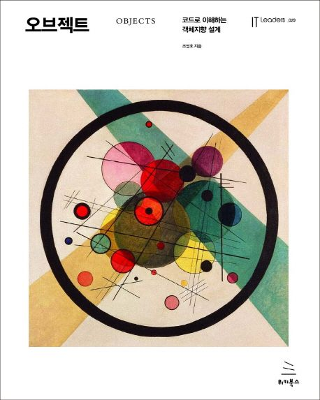

# 오브젝트

  

## 목차

## ▣ 들어가며: 프로그래밍 패러다임

### 01 패러다임의 시대

### 02 프로그래밍 패러다임

## ▣ 1장: 객체, 설계

### 01 티켓 판매 애플리케이션 구현하기

### 02 무엇이 문제인가

- 예상을 빗나가는 코드
- 변경에 취약한 코드

### 03 설계 개선하기

- 자율성을 높이자
- 무엇이 개선됐는가
- 어떻게 한 것인가
- 캡슐화와 응집도
- 절차지향과 객체지향
- 책임의 이동
- 더 개선할 수 있다
- 그래, 거짓말이다!

### 04 객체지향 설계

- 설계가 왜 필요한가
- 객체지향 설계

## ▣ 2장: 객체지향 프로그래밍

### 01 영화 예매 시스템

- 요구사항 살펴보기

### 02 객체지향 프로그래밍을 향해

- 협력, 객체, 클래스
- 도메인의 구조를 따르는 프로그램 구조
- 클래스 구현하기
- 협력하는 객체들의 공동체
- 협력에 관한 짧은 이야기

### 03 할인 요금 구하기

- 할인 요금 계산을 위한 협력 시작하기
- 할인 정책과 할인 조건
- 할인 정책 구성하기

### 04 상속과 다형성

- 컴파일 시간 의존성과 실행 시간 의존성
- 차이에 의한 프로그래밍
- 상속과 인터페이스
- 다형성
- 인터페이스와 다형성

### 05 추상화와 유연성

- 추상화의 힘
- 유연한 설계
- 추상 클래스와 인터페이스 트레이드오프
- 코드 재사용
- 상속
- 합성

## ▣ 3장: 역할, 책임, 협력

### 01 협력

- 영화 예매 시스템 돌아보기
- 협력
- 협력이 설계를 위한 문맥을 결정한다

### 02 책임

- 책임이란 무엇인가
- 책임 할당
- 책임 주도 설계
- 메시지가 객체를 결정한다
- 행동이 상태를 결정한다

### 03 역할

- 역할과 협력
- 유연하고 재사용 가능한 협력
- 객체 대 역할
- 역할과 추상화
- 배우와 배역

## ▣ 4장: 설계 품질과 트레이드오프

### 01 데이터 중심의 영화 예매 시스템

- 데이터를 준비하자
- 영화를 예매하자

### 02 설계 트레이드오프

- 캡슐화
- 응집도와 결합도

### 03 데이터 중심의 영화 예매 시스템의 문제점

- 캡슐화 위반
- 높은 결합도
- 낮은 응집도
- 캡슐화를 지켜라

### 04 자율적인 객체를 향해

- 스스로 자신의 데이터를 책임지는 객체
- 캡슐화 위반

### 05 하지만 여전히 부족하다

- 높은 결합도
- 낮은 응집도
- 데이터 중심 설계는 객체의 행동보다는 상태에 초점을 맞춘다

### 06 데이터 중심 설계의 문제점

- 데이터 중심 설계는 객체를 고립시킨 채 오퍼레이션을 정의하도록 만든다

## ▣ 5장: 책임 할당하기

### 01 책임 주도 설계를 향해

- 데이터보다 행동을 먼저 결정하라
- 협력이라는 문맥 안에서 책임을 결정하라
- 책임 주도 설계

### 02 책임 할당을 위한 GRASP 패턴

- 도메인 개념에서 출발하기
- 정보 전문가에게 책임을 할당하라
- 높은 응집도와 낮은 결합도
- 창조자에게 객체 생성 책임을 할당하라

### 03 구현을 통한 검증

- DiscountCondition 개선하기
- 타입 분리하기
- 다형성을 통해 분리하기
- 변경으로부터 보호하기
- Movie 클래스 개선하기
- 변경과 유연성

### 04 책임 주도 설계의 대안

- 메서드 응집도
- 객체를 자율적으로 만들자

## ▣ 6장: 메시지와 인터페이스

### 01 협력과 메시지

- 클라이언트-서버 모델
- 메시지와 메시지 전송
- 메시지와 메서드
- 퍼블릭 인터페이스와 오퍼레이션
- 시그니처

### 02 인터페이스와 설계 품질

- 묻지 말고 시켜라
- 의도를 드러내는 인터페이스
- 함께 모으기

### 03 원칙의 함정

- 디미터 법칙은 하나의 도트(.)를 강제하는 규칙이 아니다
- 결합도와 응집도의 충돌

### 04 명령-쿼리 분리 원칙

- 반복 일정의 명령과 쿼리 분리하기
- 명령-쿼리 분리와 참조 투명성
- 책임에 초점을 맞춰라
