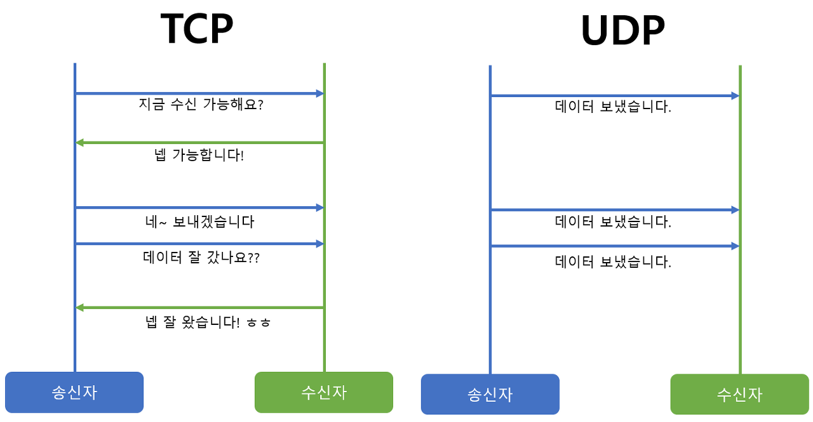
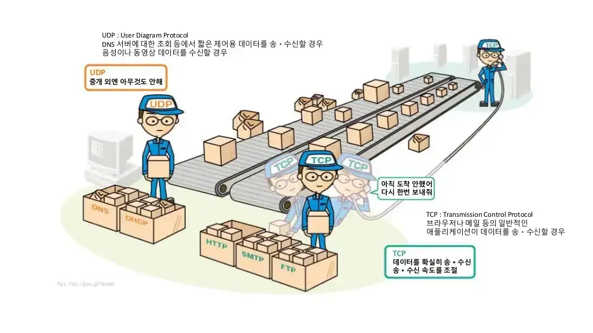

# TCP vs UDP

- TCP와 UDP는 OSI 7 계층 중 Layer 4: 전송계층에서 사용되는 프로토콜입니다.
- 전송계층은 프로토콜 내에서 송신자와 수신자를 연결하는 통신 서비스를 제공하는 계층인데, IP에 의해 전달되는 패킷의 오류를 검사하고 재전송 요구 등의 제어를 담당합니다.

## TCP(Transmission Control Protocol)
- TCP는 신뢰성 있는 데이터 전송을 지원하는 연결 지향형 프로토콜입니다. 일반적으로 TCP와 IP가 함께 사용되는데, IP가 데이터의 전송을 처리한다면 TCP는 패킷 추적 및 관리를 하게 됩니다. 연결 지향형인 TCP는 3-way handshaking이라는 과정을 통해 연결 후 통신을 시작하는데, 흐름 제어와 혼잡 제어를 지원하며 데이터의 순서를 보장합니다.

> 흐름 제어: 보내는 측과 받는 측의 데이터 처리속도 차이를 조절해주는 것

> 혼잡 제어: 네트워크 내의 패킷 수가 넘치게 증가하지 않도록 방지하는 것

🔎 특징
- 연결형 서비스로 가상 회선 방식을 제공
- 데이터의 전송 순서 보장
- 데이터의 경계를 구분하지 않음
- 신뢰성 있는 데이터 전송
- UDP보다 전송속도가 느림
- 연결을 설정(3-way handshaking)과 해제(4-way handshaking)

## UDP
- UDP는 비연결형 프로토콜로써, 인터넷상에서 서로 정보를 주고받을 때 정보를 보낸다는 신호나 받는다는 신호 절차를 거치지 않고 보내는 쪽에서 일방적으로 데이터를 전달하는 통신 프로토콜입니다. TCP와는 다르게 연결 설정이 없으며, 혼잡 제어를 하지 않기 때문에 TCP보다 전송 속도가 빠릅니다. 그러나 데이터 전송에 대한 보장을 하지 않기 때문에 패킷 손실이 발생할 수 있습니다.

🔎 특징
- 비연결형 서비스로 데이터그램 방식을 제공
- 비신뢰성
- 데이터의 경계를 구분
- 패킷 오버해드가 적어 네트워크 부하 감소
- 혼잡 제어를 하지 않기 때문에 TCP보다 빠름
- TCP의 handshaking 같은 연결 설정이 없음

## TCP vs UDP
| TCP(Transfer Control Protocol) | UDP(User Datagram Protocol) |
| ------ | ---- |
| 연결형 프로토콜 | 비연결형 프로토콜 |
| 데이터의 경계를 구분하지 않음 | 데이터의 경계를 구분함 |
| 신뢰성있는 데이터 전송 (데이터 재전송 존재O) | 비신뢰성 데이터 전송 (데이터 재전송 존재X) |
| 일 대 일(Unicast) 통신	 | 일 대 일, 일 대 다(Broadcast), 다 대 다(Multicast) 통신  |

### 요약
- TCP는 연속성보다 신뢰성 있는 전송이 중요할 때에 사용되는 프로토콜
- UDP는 TCP보다 빠르고 네트워크 부하가 적다는 장점이 있지만 신뢰성 있는 데이터 전송을 보장하지는 않습니다.
- 그렇기 때문에 신뢰성보다는 연속성이 중요한 실시간 스트리밍과 같은 서비스에 자주 사용됩니다.

