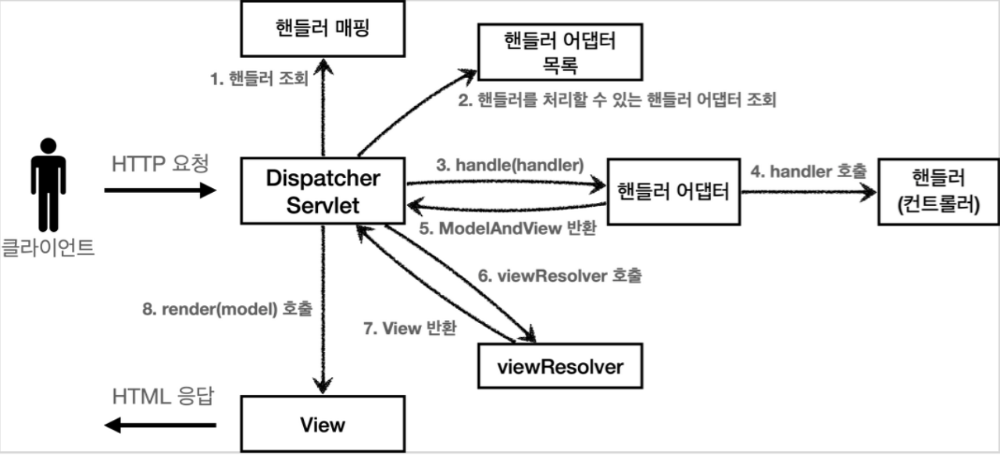

# DispatcherServlet이란

- 스프링 MVC에서 Front Controller 역할을 수행.
	- 프론트 컨트롤러를 사용하는 이유
		1. **일관성**: 모든 요청은 동일한 접점, 즉 프론트 컨트롤러를 통과합니다. 이는 요청 처리 과정의 일관성을 보장하며, 각 요청이 동일한 보안 체크, 인증 절차, 로깅 등을 거치게 할 수 있습니다.
		2. **중복 코드 제거**: 각 컨트롤러에서 요청을 개별적으로 처리하면, 보안 검사나 로깅과 같은 공통 태스크를 반복적으로 구현해야 할 수 있습니다. 이런 반복적인 코드는 유지 관리 비용을 증가시키고 버그를 초래할 수 있습니다. 프론트 컨트롤러를 사용하면 이런 공통 태스크를 한 곳에서 관리할 수 있습니다.
		3. **유연성**: 프론트 컨트롤러를 사용하면 요청 처리 흐름을 좀 더 유연하게 조절할 수 있습니다. 예를 들어, 특정 조건에 따라 다른 컨트롤러를 선택하거나, 다양한 뷰를 선택하는 등의 라우팅 로직을 쉽게 변경할 수 있습니다.

- SpringMVC에서 http 요청이 오는 경우 전체적인 흐름
	1. 클라이언트에서 HTTP 요청이 발생
	2. 웹 컨테이너는 등록된 필터를 차례대로 실행(필터는 요청을 변경하거나 특정 조건에 따라 요청을 차단)
	3. 모든 필터를 통과한 요청이 DispatcherServlet에 전달
	4. DispatcherServlet은 HandlerMapping을 통해 요청을 처리할 적절한 핸들러 탐색
	5. 해당 요청을 가로채는 HandlerInterceptor의 preHandle() 메서드가 호출
	6. DispatcherServlet은 HandlerAdapter를 사용하여 찾아낸 핸들러의 메서드를 호출
	7. 컨트롤러는 모델 데이터를 생성하고, 뷰 이름을 반환(ModelandView)
	8. HandlerInterceptor의 postHandle() 메서드가 호출
	9. DispatcherServlet은 ViewResolver를 사용하여 반환된 뷰 이름을 실제 뷰로 변환
	10. 뷰가 렌더링되고 클라이언트에게 HTML이 전송
	11. 마지막으로, HandlerInterceptor의 afterCompletion() 메서드가 호출되며 요청 처리가 완료

- DispatcherServlet의 예외처리
	1. **컨트롤러에서의 예외 발생**: 컨트롤러의 메소드 실행 중에 예외가 발생할 수 있습니다. 이 예외는 컨트롤러 내에서 처리되지 않고 메소드를 호출한 DispatcherServlet에게 전달됩니다.
	2. **HandlerExceptionResolver 호출**: DispatcherServlet는 예외를 잡아내고, 이를 처리하기 위해 HandlerExceptionResolver 인터페이스의 구현체를 호출합니다. 기본적으로, 스프링 MVC는 DefaultHandlerExceptionResolver를 제공합니다. 이 구현체는 일반적인 스프링 MVC 예외 타입들을 HTTP 상태 코드로 변환합니다.
	3. **@ExceptionHandler**: 커스텀 예외 처리를 위해 `@ExceptionHandler` 어노테이션을 사용할 수 있습니다. 이 어노테이션을 사용하여 특정 예외 타입을 처리하는 메소드를 컨트롤러 내부에 정의할 수 있습니다. 이 메소드는 DispatcherServlet에 의해 호출되며, 해당 예외 타입이 발생할 때 실행됩니다.
	4. **@ControllerAdvice**, **@RestControllerAdvice**: `@ControllerAdvice` 어노테이션과 `@RestControllerAdvice`을 사용하여 예외 처리 메소드를 전역 범위에서 사용할 수 있습니다. 이 어노테이션은 **HandlerExceptionResolver** 의 역할을 수행하게 되며, `@ExceptionHandler`와 함께 사용되며, `@ExceptionHandler`를 가진 메소드를 모든 컨트롤러에서 사용 가능하게 합니다.