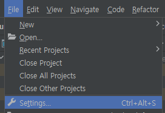

# IntelliJ(인텔리제이) Spring Boot DevTools 적용

## IntelliJ(인텔리제이) Spring Boot DevTools 적용하기
Spring Boot DevTools는 소스 변경이 발생할 때마다 빠르게 자동 빌드해줘서 바로바로 반영 결과를 확인할 수 있도록 도와주는 유용한 툴입니다.

STS에서는 Dependency만 추가하면 잘 동작하던 DevTools가 인텔리제이 (IntelliJ)에서는 최초 약간의 설정을 해줘야 정상 동작을 합니다. 그 설정은 아래와 같습니다.

 

## 1. 의존성(Dependency) 추가
먼저 Spring Boot DevTools의 의존성을 추가를 해야 합니다. Gradle 프로젝트는 build.gradle 파일에 아래와 같이 dependecies 아래 developmentOnly 'org.springframework.boot:spring-boot-devtools' 의존성을 추가해줍니다.

```
dependencies {
	developmentOnly 'org.springframework.boot:spring-boot-devtools'
}
 ```

Maven 프로젝트는 pom.xml 파일의 dependecies 아래에 아래의 의존성을 추가해줍니다.

```
<dependencies>
		<dependency>
			<groupId>org.springframework.boot</groupId>
			<artifactId>spring-boot-devtools</artifactId>
			<scope>runtime</scope>
			<optional>true</optional>
		</dependency>
<dependency>
```

## 2. IntelliJ(인텔리제이) Spring Boot DevTools 사용을 위한 설정
인텔리 제어에서 스프링 부트 DevTools 사용을 위한 설정은 아래와 같습니다.

 - Compiler 세팅

1. 상단 File > Settings 메뉴 혹은 단축키 Ctrl + Alt + S를 눌러서 세팅 메뉴로 이동합니다.



2. Build, Exeution, Deployment > Compiler > Build project autiomaically 체크


 - Advanced 세팅

IntelliJ 2021.2대의 최신 버전에서는 해당 메뉴의 이름 및 위치가 기존 Registry에서 Advanced setting으로 변경이 되었습니다.

 

1. Advanced Settings > Allow auto-make to start even if developed application is currently running 체크


위의 설정을 완료하면, Spring boot 프로젝트가 실행 중인 상황에서 STS나 eclipse에서와 같이 코드의 변경이 발생하였을 때 자동으로 빌드를 해줘서 바로바로 변경 내용을 확인할 수 있습니다.